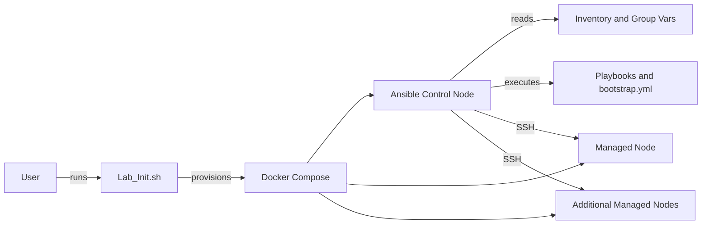

# Ansible Lab Architecture

## Purpose
The Ansible Lab provides a controlled, repeatable environment for developing and testing Ansible automation.  
It is designed to mimic common infrastructure automation workflows while remaining lightweight and disposable.

---

## Design Principles
- Repeatability over realism
- Idempotency by default
- Disposable infrastructure
- Explicit, predictable behaviour

---

## Non-Goals
- Not intended for production use
- Not a full enterprise infrastructure simulation
- Not designed for multi-user or shared access

---

## High-Level Architecture
- Ansible control node
- Managed nodes
- Shared inventory and variables
- Shell-based lifecycle management

---

## Architecture Diagram

## Core Components

### Ansible Control Node
- Executes playbooks
- Hosts inventory and configuration
- Acts as the central orchestration point

### Managed Nodes
- Act as Ansible targets
- Container-based
- Stateless by design

### Inventory
- Static inventory under `inventory/`
- Group variables under `inventory/group_vars/`

### Playbooks
- `bootstrap.yml` for initial setup
- `playbooks/` directory for experimentation and iteration

### Docker Layer
- `Dockerfile` defines the runtime environment
- `docker-compose.yml` manages container lifecycle

### Lifecycle Scripts
- `Lab_Init.sh` creates and initialises the lab
- `Lab_Remove.sh` destroys and resets t_
